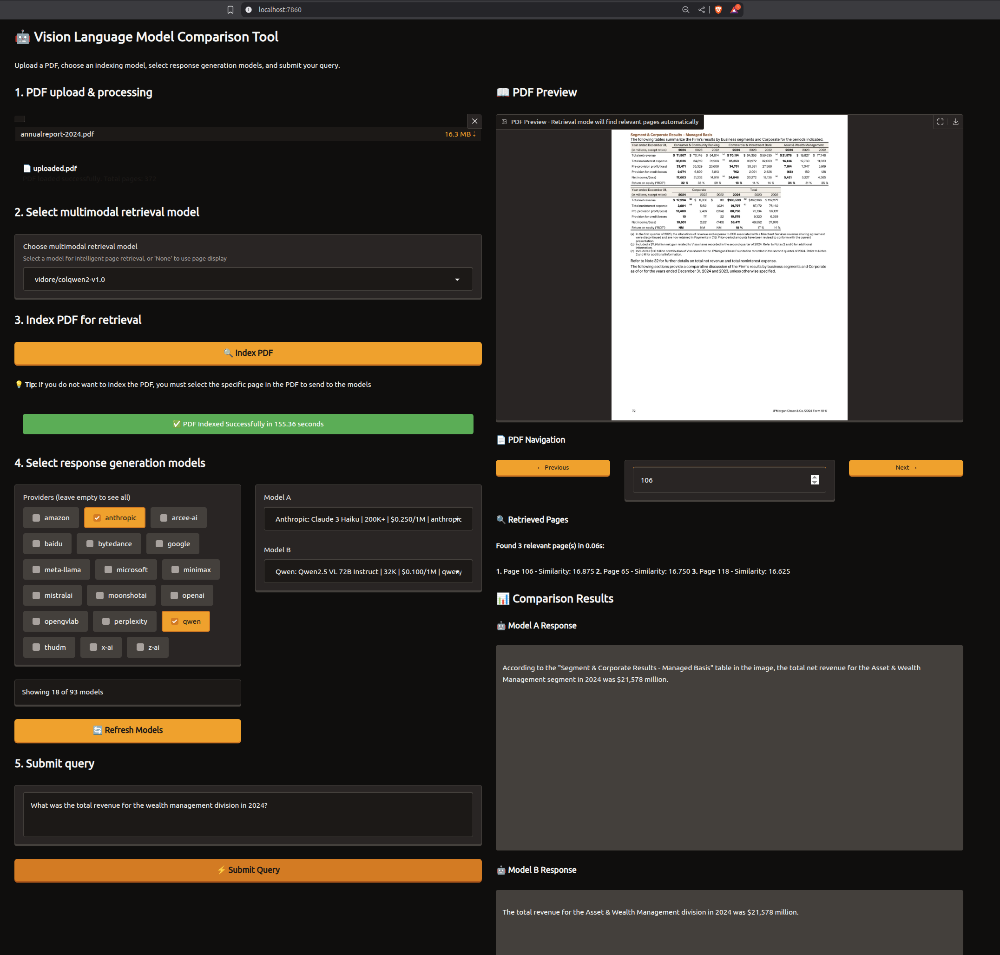

# VLM Comparison Tool

A web application for comparing Vision Language Models (VLMs) on PDF documents using [OpenRouter](https://openrouter.ai/)'s API. Upload a PDF, generate an index with a multimodal embedding model, ask your questions, and compare responses from different VLMs side-by-side. 

This application is primarily useful as a demonstration of how to do information retrieval with multimodal embedding models. After the retrieval step, we generate a final response using your choice of vision language model. The reason we present two models for doing the response generation is simply to help you determine which model you prefer to use - as a "vibe check" on quality and consistency of the responses. Consider this a tool to narrow down your choices of embedding model + response model.  

## Features

- **Model Selection**: Choose from any vision-capable models available on OpenRouter
- **Advanced Filtering**: Filter models by provider and see their different options and pricing
- **PDF Processing**: Upload PDFs and browse pages with real-time preview
- **Multimodal PDF Indexing**: Generate embeddings used to index entire PDFs using state-of-the-art multimodal retrieval models
- **Intelligent Page Retrieval**: Automatically find the most relevant pages based on your questions
- **Side-by-Side Comparison**: Compare responses from two models simultaneously

## PDF Indexing & Multimodal Retrieval

The tool features an advanced multimodal retrieval system that can intelligently index and search through entire PDF documents:

### Supported Retrieval Models

The supported models include only those in the [ColVision](https://github.com/illuin-tech/colpali) series: 

- **ColQwen2-v1.0** (`vidore/colqwen2-v1.0`) - Multimodal embedding model based on Qwen2-VL
- **ColPali-v1.3** (`vidore/colpali-v1.3`) - Multimodal embedding model based on Paligemma

### How PDF Indexing Works

1. **Upload & Index**: Upload a pdf and index it using one of the multimodal embedding models
2. **Visual + Text Understanding**: The retrieval models analyze both visual elements (charts, diagrams, layouts) and textual content
3. **Intelligent Page Selection**: Instead of manually browsing pages, ask questions and the system finds the most relevant pages automatically
4. **Contextual Retrieval**: Get answers that span multiple pages when relevant information is distributed across the document

By using a model that was trained to associate query-image pairs we can bypass the need for using page layout detection and OCR, effectively making a more simplistic and effective information retrieval pipeline.

### Screenshot

An illustrative example is below. We uploaded a 372 page PDF of a [JPM yearly report](https://www.jpmorganchase.com/content/dam/jpmc/jpmorgan-chase-and-co/investor-relations/documents/annualreport-2024.pdf), which took 155 seconds to index on an Nvidia H100 GPU. We then selected two models and prompted with "What was the total revenue for the wealth management division in 2024?". It took 0.06 seconds to retrieve the top three most relevant pages and then it passed those images to the VLMs through the OpenRouter API for them to generate their response. Both models correctly answered from page 106 with $21,578mm. 




## Response Generation

### Vision Language Models (VLMs)

The tool automatically fetches all vision-capable models from [OpenRouter](https://openrouter.ai/models), including:
- GPT-4 Vision models (OpenAI)
- Claude models with vision (Anthropic)
- LLama vision models (Facebook)
- Gemini Pro Vision (Google)
- Qwen-VL (Alibaba)
- And many more

Choose from a massive collection of VLMs and compare their responses side-by-side.


## Prerequisites

- Python 3.8+
- OpenRouter API key
- CUDA-compatible GPU (required for PDF indexing)

## Installation

1. Clone the repository:
```bash
git clone <repository-url>
cd vlm-comparison-tool
```

2. Install uv (recommended - fast Python package manager):
```bash
curl -LsSf https://astral.sh/uv/install.sh | sh
```

3. Install dependencies:

Using uv (recommended):
```bash
uv sync
```

Using pip with pyproject.toml:
```bash
pip install -e .
```

Or install dependencies manually:
```bash
pip install gradio pymupdf pillow requests torch transformers byaldi psutil python-dotenv gputil
```

4. Set up your OpenRouter API key:
```bash
export OPENROUTER_API_KEY="your-api-key-here"
```

## Getting an API Key

1. Visit [https://openrouter.ai/](https://openrouter.ai/)
2. Sign up or log in to your account
3. Navigate to the API Keys section
4. Create a new API key
5. Set it as the `OPENROUTER_API_KEY` environment variable

## Usage

1. Start the application:
```bash
uv run app.py
```

If not using uv:
```bash
python app.py
```

2. Open your browser to `http://localhost:7860`

## Advanced Usage

### PDF Indexing Tips

- **First Use**: Allow extra time for model downloads onto your system (30 seconds to a minute)
- **GPU Memory**: Monitor GPU usage in logs - the system will warn about memory issues
- **Large PDFs**: Indexing time scales with document size; typical research papers index in 30-60 seconds

### Retrieval vs Single Page Mode

- **Use Retrieval When**:
  - You have questions that might span multiple pages
  - You're exploring a large document without knowing where information is located
  - You want to find all relevant sections for a complex query

- **Use Single Page When**:
  - You know exactly which page contains the information
  - You want to analyze a specific diagram, chart, or section
  - You need faster response times (no indexing required)

## Configuration

The application runs on `http://localhost:7860` by default. To change this:

```python
demo.launch(
    server_name="0.0.0.0",  # Allow external access
    server_port=7860,       # Change port here
    share=False             # Set to True for public sharing
)
```

## API Limits

- **Response Length**: 4000 tokens maximum per response
- **Timeout**: 60 seconds per model query
- **Pricing**: Varies by model (displayed in the interface)

## Cloud Deployment

### Deploy with SkyPilot

For GPU deployment on cloud infrastructure:

1. Launch the application on a cloud GPU instance:
```bash
sky launch -c vlm-compare skypilot/H100/config.yaml
```

2. Once the cluster is running, set up port forwarding to access the web interface:
```bash
ssh vlm-compare -L 7860:localhost:7860
```

3. Access the application in your browser at `http://localhost:7860`

Note: The SkyPilot configuration automatically:
- Provisions an H100 GPU instance on GCP
- Installs all dependencies including CUDA 12.1
- Exposes ports 7860 (Gradio) and 8888 (Jupyter, optional)
- Runs the application with `uv run app.py`

## Troubleshooting

### "No VLM models available - check API key"
- Verify your `OPENROUTER_API_KEY` environment variable is set correctly
- Check that your API key is valid and has sufficient credits
- Try clicking the "Refresh" button

### PDF Processing Errors
- Ensure your PDF is not corrupted or password-protected
- Check that the page number exists in the document

### Retrieval System Issues
- **"Retrieval model not loading"**: Check GPU memory availability, try restarting
- **"Out of GPU memory"**: Use a smaller retrieval model (ColPali instead of ColQwen2) or ensure sufficient GPU memory (24GB+ recommended)
- **"Indexing failed"**: Check logs for detailed error messages, ensure PDF is valid
- **"No relevant pages found"**: Try rephrasing your question or use single-page mode

### Performance Issues
- **Slow indexing**: Ensure CUDA drivers are installed and GPU is available
- **High memory usage**: Monitor the logs/indexing_*.log files for memory statistics
- **Model download stuck**: Check internet connection, downloads can be 1-4GB per model

### Model Query Errors
- Some models may be temporarily unavailable
- Check your OpenRouter account for sufficient credits
- Try a different model combination

## Technical Details

### Dependencies
- **Core**: Gradio, PyMuPDF, Pillow, requests
- **Retrieval**: torch, transformers, byaldi (for ColPali/ColQwen models)

### Logging & Monitoring
- Application logs: `logs/app_YYYYMMDD_HHMMSS.log`
- Indexing logs: `logs/indexing_YYYYMMDD_HHMMSS.log`
- GPU usage and timing statistics included in logs

### Model Storage
- Retrieval models are cached locally after first download
- Typical model sizes: 2-4GB each
- Models stored in HuggingFace cache directory

## Contributing
2. Create a feature branch
3. Make your changes
4. Test thoroughly
5. Submit a pull request

## License

This project is open source and available under the MIT License.